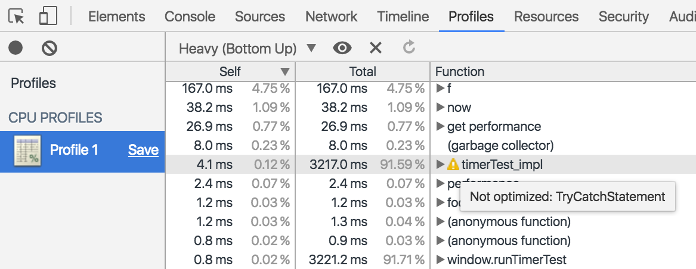

# JS Performance <br> Deep Magic

&nbsp;

### Andy Hall
### Tokyo JS 2016.8.12


---

## First, a parable:


```js
var n = 5

for (var i=0; i<arr.length; i++) {
    arr[i] = n * n
}
```
<!-- .element: class="fragment" data-fragment-index="1" -->

> "Gee, this array is really huge...  
> Maybe I should think about performance."

<!-- .element: class="fragment" data-fragment-index="2" -->


---

> "First, I'll cache `n*n` and `arr.length`,  
> so the JS engine doesn't need to keep calculating them."

<br>

```js
var len = arr.length
var nsq = 5 * 5

for (var i=0; i<len; i++) {
    arr[i] = nsq
}
```

---

> "Also, didn't I read somewhere that  
> `i--` is faster than `i++`?"

<br>

```js
var len = arr.length
var nsq = 5 * 5

for (var i=len-1; i>=0; i--) {
    arr[i] = nsq
}
```

---

> "Actually, why not just benchmark it?"

<br>

```js
function myTimer(fn) {
    var t = performance.now() + 1000
    var ct = 0
    while(performance.now() < t) {
        fn()
        ct++
    }
    return ct/1000 + 'k calls per second!'
}
```

---

# Naive version

```js
var n = 5

for (var i=0; i<arr.length; i++) {
    arr[i] = n * n
}
// 
```

<!-- .slide: data-state="codeEditable1" -->
<button onclick="runTimerTest('arr')">Time it!</button>


---

# "Optimized" version

```js
var len = arr.length
var nsq = 5 * 5

for (var i=len-1; i>=0; i--) {
    arr[i] = nsq
}
//
```

<!-- .slide: data-state="codeEditable2" -->
<button onclick="runTimerTest('arr')">Time it!</button>


---

## `(._. )( ･_･)(･_･ )( ･_･)ｱﾚ？`


<br>

Okay, forget syntax and let's answer a real question:
<!-- .element: class="fragment" data-fragment-index="1" -->

```js
                n * n

                Math.pow(n, 2)
```
<!-- .element: class="fragment" data-fragment-index="1" -->

<br>

Which is faster? <!-- .element: class="fragment" data-fragment-index="1" -->


---

# n*n

```js
for (var n=0; n<1000; n++) {
    var a = n * n
}
//
```

<!-- .slide: data-state="codeEditable1" -->
<button onclick="runTimerTest()">Time it!</button>


---

# Math.pow

```js
for (var n=0; n<1000; n++) {
    var a = Math.pow(n, 2)
}
//
```

<!-- .slide: data-state="codeEditable2" -->
<button onclick="runTimerTest()">Time it!</button>


---

# Confession time:

```js
for (var n=0; n<1000; n++) {
    // var a = Math.pow(n, 2)
}
//
```

<!-- .slide: data-state="codeEditable1" -->
<button onclick="runTimerTest()">Time it!</button>


---

<br>

## (╯°□°）╯︵ ┻━┻

<br>

<br>

### (Here endeth the parable)
<!-- .element: class="fragment" data-fragment-index="1" -->

---

## Takeaways

 * Shit is weird yo! <!-- .element: class="fragment" data-fragment-index="1" -->
 * To speed up JS you need some idea how  
 your JS engine works <!-- .element: class="fragment" data-fragment-index="2" -->
 * Same goes for measuring performance! <!-- .element: class="fragment" data-fragment-index="3" -->


---

# v8


---

## Prehistoric JS interpreters

<br>

 1. parse/compile code
 2. run it


---

# v8 architecture:

<br>

 1. Compile code
 2. Run it
 3. Gather info from real-time profiler
 4. Dynamically recompile
   * some functions get optimized <!-- .element: class="fragment" data-fragment-index="1" -->
   * others get de-optimized <!-- .element: class="fragment" data-fragment-index="1" -->


---

# The two compilers:

 * Base compiler  
 (Slow but runs anything)
   
 * Optimizing compiler  
 (Fast but limited)  

<br>(Technically there are two optimizing compilers:  
[crankshaft](http://blog.chromium.org/2010/12/new-crankshaft-for-v8.html) and [turbofan](http://blog.chromium.org/2015/07/revving-up-javascript-performance-with.html))


---

## Optimistic Optimizations

<br>

```js
[general code]
```
<!-- .element: class="fragment" data-fragment-index="1" -->

## ↓ 
<!-- .element: class="fragment" data-fragment-index="3" -->

```js
if (assumption) {
    [optimized code]
} else {
    [deopt]
}
```
<!-- .element: class="fragment" data-fragment-index="3" -->


---

# Example

<br>

```js
function addTwo(n) {
    return n + 2
}
```
<!-- .slide: data-state="codeEditable1" -->


---

# Bailouts

<br>
Means v8 has *given up* on optimizing the function

<br>

### Fix these before you do anything else!

<!-- .element: class="fragment" data-fragment-index="1" -->

---

# Finding bailouts:


---

# Finding bailouts:




---

## Bailout reasons

<br>

 * `try/catch`
 * `eval`
 * `for (a in b)` with non-local vars
 * various ES2015+ syntax
 * lots of weird stuff you shouldn't do anyway
 * "Optimized too many times"

<br>

[Full list of v8 bailout reasons](https://github.com/vhf/v8-bailout-reasons)

---

# Deopt demo
<!-- .slide: data-state="showOptStatus1" -->

```js
var foo
try {
    foo = 3
} catch(e) {}
```

<br>

> Opt status: **(unknown)**  


---

## Takeaways

 * Bailouts are the lowest-hanging fruit of optimization <!-- .element: class="fragment" data-fragment-index="1" -->
 * "Clever" code tends to deopt <!-- .element: class="fragment" data-fragment-index="2" -->
 * "Optimized too many times" means v8 barfed. Usually involves types! <!-- .element: class="fragment" data-fragment-index="3" -->


---

# Tip

When you need features that can't be optimized,  
wrap the hot code in a separate function.

```js
function foo() {
    try {
        bar()
    } catch (e)
}

function bar() {
    // ....
}
```
<!-- .slide: data-state="codeEditable1" -->


---

# Optimizations


---

# v8 can do:

 * Dead code elimination (DCE)
 * Loop-invariant code motion (LICM)
 * Inlining
 * Type inference **<-- where the magic is**<!-- .element: class="fragment" data-fragment-index="2" -->
 * ..and much more!

<!-- .element: class="fragment" data-fragment-index="1" -->

---

# Example: DCE

```js
var foo = false

for (var i=0; i<arr.length; i++) {
    if (foo) arr[i] = Math.sqrt(i)
}
//
```

<!-- .slide: data-state="codeEditable1" -->
<button onclick="runTimerTest('arr')">Time it!</button>


---

# Example: LICM

```js
for (var i=0; i<arr.length; i++) {
    arr[i] = Math.sqrt(arr.length)
}
//
```

<!-- .slide: data-state="codeEditable2" -->
<button onclick="runTimerTest('arr')">Time it!</button>


---

# Inlining

 * v8 inlines functions when they're *short* and *safe*
 * *Short* means < ~600 characters
 * *Safe* is complicated  
 (but pure functions are safe)
 * Details will change, best not to worry about them!


---

## Inlining takeaway:

<br>

```js
function squared (n) {
    return n * n
}
```
<!-- .slide: data-state="codeEditable1" -->

---

# Type inference


---

# Intuition:


```js
  return a + b
```

### ↓ <!-- .element: class="fragment" data-fragment-index="1" -->

```js
  return general_add(a, b)
```
<!-- .element: class="fragment" data-fragment-index="1" -->

### ↓ <!-- .element: class="fragment" data-fragment-index="2" -->

```js
  assert_float(a)
  assert_float(b)
  return float_add(a, b)
```
<!-- .element: class="fragment" data-fragment-index="2" -->


---

# Number types

* SMI (31 bit signed integers) <!-- .element: class="fragment" data-fragment-index="1" -->
* Double (float) <!-- .element: class="fragment" data-fragment-index="2" -->
* Number object (general case - SLOW) <!-- .element: class="fragment" data-fragment-index="3" -->


---

# Casting numbers

```js
function (n) {
    var a = n|0            // int
    var b = +n             // float
    var c = new Number(n)  // bad idea
}
```

<!-- .slide: data-state="codeEditable1" -->


---

# Pop quiz!

>> `i++`  
>> `j--`

Which is faster?

---

# Monomorphism


```js
function add (a, b) {
    return a + b
}
```

```js
add (1, 2)      // :)
add (3, 4)      // :)
add (5, 'six')  // @_@
add (7, 8)      // :( 
```

<!-- .element: class="fragment" data-fragment-index="1" -->

### Optimizations rely on functions being monomorphic! 
<!-- .element: class="fragment" data-fragment-index="2" -->


---

The easy way to enforce monomorphism is  
with wrapped implementations:

<br>

```js
module.exports = function (num, str) {
    var n = +num || 0.0
    var s = String(str)
    impl(n, s)
}

function impl (num, str) {
    // this function will stay monomorphic!
}
```

---

# Object types


---

# enter the IC!

> "Internal cache"  
> &nbsp;  
> sometimes known as  
> "hidden class" or "map" 


---

## IC construction

```js
function Point(x, y) {
    this.x = x
    this.y = y
}
var p = new Point(1, 3)


var p2 = {}
p2.x = 1
p2.y = 3
```
<!-- .slide: data-state="codeEditable1" -->


---

## Monomorphism and ICs

<br>

```js
var p = new Point(2, 3)

foo(p)

p.z = 0

foo(p)
```
<!-- .element: class="fragment" data-fragment-index="1" -->

# :(
<!-- .element: class="fragment" data-fragment-index="2" -->


---

# Takeaways

 * Make classes declare all properties at init <!-- .element: class="fragment" data-fragment-index="1" -->
 * Don't sweat the details (e.g. constructors vs. prototypes) <!-- .element: class="fragment" data-fragment-index="2" -->


---

# Special case: Arrays

> "Just an object with a magical `length` property"


---

# Array cases

<br>

 * (fastest)
 * **All elements same type, filled from 0, no holes** <!-- .element: class="fragment" data-fragment-index="1" -->
 *  <!-- .element: class="fragment" data-fragment-index="3" -->
 * (let's not worry about the others) <!-- .element: class="fragment" data-fragment-index="3" -->
 *  <!-- .element: class="fragment" data-fragment-index="3" -->
 * **Dictionary mode** <!-- .element: class="fragment" data-fragment-index="2" -->
 * (slowest)


---

# Array tips

<br>

 * Avoid holes or mixed types
 * Don't preallocate
 * Don't delete elements (`pop` is fine)
 * Never access out of bounds!


---

# Conclusions


* ~97% of the time, **simple idiomatic code wins**  
* Don't microbenchmark. Profile real code! <!-- .element: class="fragment" data-fragment-index="1" -->
* Fix bailouts first <!-- .element: class="fragment" data-fragment-index="2" -->
* Adding type hints never hurts <!-- .element: class="fragment" data-fragment-index="3" -->
* Pure functions with predictable types reach ~native speeds <!-- .element: class="fragment" data-fragment-index="4" -->
* Clever hacks (eg with scope) are usually slow <!-- .element: class="fragment" data-fragment-index="5" -->
* Ignore these rules for code that isn't hot <!-- .element: class="fragment" data-fragment-index="6" -->


---

# Forget all voodoo!
# Write great code!


---

# Thanks!

## [github/andyhall](https://github.com/andyhall)

## [@fenomas](https://twitter.com/fenomas)


